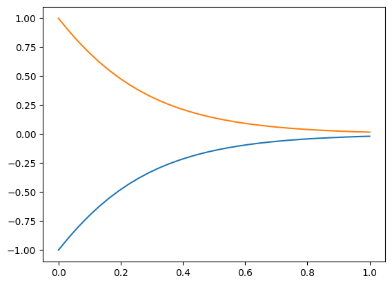

# A Guide to Neural Ordinary Differential Equations

This repository contains an in-depth tutorial to help AI/ML practitioners
successfully use neural ordinary differential equations (Neural ODEs or NODEs),
understand the mathematics, know which types of differentiation to use, and
the types of regularization available to achieve desired performance.

This repository accompanies the paper "A Guide to Neural Ordinary Differential
Equations: Machine Learning for Data-Driven Digital Engineering" which is
currently in review for publication. The citation to the paper will be included
here when the paper has been published.

If you find the paper or the code in this repository helpful, please cite
this work with (TODO - will complete when accepted for publication):
```{bibtex}
@article{worsham2025nodeguide,
  title={A Guide to Neural Ordinary Differential Equations: Machine Learning for Data-Driven Digital Engineering},
  author={Worsham, Joseph and Kalita, Jugal},
  year={2025}
}
```


## References and Acknoledgements

Much of the implementation was inspired by [`tfdiffeq`](https://github.com/titu1994/tfdiffeq)
repository authored by [@titu1994](https://github.com/titu1994).

The following articles contributed heavily to the developed theory and implementation:
- Chen, Ricky TQ, et al. "Neural ordinary differential equations." Advances in neural
information processing systems 31 (2018).
- Dupont, Emilien, Arnaud Doucet, and Yee Whye Teh. "Augmented neural odes." Advances
in neural information processing systems 32 (2019).
- Massaroli, Stefano, et al. "Dissecting neural odes." Advances in Neural Information
Processing Systems 33 (2020): 3952-3963.
- Norcliffe, Alexander, et al. "On second order behaviour in augmented neural odes."
Advances in neural information processing systems 33 (2020): 5911-5921.


## Example Problems

### Pendulum

The first problem approached in the accompanying publication is the simple
[pendulum model](example_systems/pendulum/pendulum_system.py). A batch of
pendulum trajectories on a phase plot is shown below:

.

A neural ODE learned phase plot looks like:


### XOR

The most simple non-linearly separable problem is the XOR problem. Neural ODEs
are unable to produce trajectories that cross without using some form of
augmentation. The XOR problem is visualized as:

.

The output below is the best that a standard neural ODE can achieve without
abusing the step size to cross the x boundary:



However, a second-order neural ODE is able to solve the problem because
adding a velocity to the problem adds additional dimensions used for
separation. This is similar to how kernel machines enable linear models
to solve non-linear problems.


### Nested Spheres

The second problem is a non-linearly separable nested spheres problem.


This problem is challenging for standard neural ODEs because, like the
XOR problem, trajectories cannot cross. However, a SONODE is able to find
good solutions to the problem:

.

When the solution is viewed as a 3D trajectory in time, the method used to
separate the inner circle and the outer circle becomes evident:


## Defining a Dynamical System

A dynamical system is defined by the following components:
- $x(t) \in \mathbb{R}^n$: the $n$-dimensional state that defines the system,
- $u(t) \in \mathbb{R}^k$: the $k$-dimensional control applied to the system at time $t$,
- $z(t) \in \mathbb{R}^m$: the $m$-dimensional observation of the system at time $t$,
- $w(t) \in \mathbb{R}^s$: the $s$-dimensional process noise applied to the system state.

The way that a dynamical system transfers from one state to the next is defined
by the differential equation $\dot{x}(t, x(t), u(t)) \mapsto \mathbb{R}^n$. Any of
these components could, in theory, be learned by a neural network and trained via
a neural ODE loss.

## Code Overview

The `tensorflow_dynamics` folder is a python package that implements a neural ODE
from scratch using [TensorFlow 2.X](https://www.tensorflow.org/) and it's embedded
version of [Keras](https://keras.io/).

### Components

The `tensorflow_dynamics.components` package contains the object-oriented classes
that define the different elements of a dynamical system. Each of these components
will be extended to provide logic for specific dynamical systems. Components include:
- [`controller.Controller`](tensorflow_dynamics/components/controller.py): The controller implements
$u(t, x(t)) \mapsto \mathbb{R}^k$ to return the controlling vector for a controlled system.
Not required for uncontrolled systems.
- [`noise.WhiteNoise`](tensorflow_dynamics/components/noise.py): A basic Gaussian white noise
, $w(t, x(t), u(t)) \mapsto \mathbb{R}^s$, that can be used when modeling noisy systems or stochastic
differential equations. Other forms of noise can be implemented by extending
[`noise.Noise`](tensorflow_dynamics/components/noise.py).
- [`sensor.Sensor`](tensorflow_dynamics/components/sensor.py): The sensor system that converts a system
state to an observation: $z(t, x(t), u(t)) \mapsto \mathbb{R}^m$. Not required for all problems.
- [`system.System`](tensorflow_dynamics/components/system.py): The core function that maps a system's
state to it's derivative in time: $\dot{x}(t, u(t)) \mapsto \mathbb{R}^n$. Required for all neural ODE problems.

### Differential Equations

The `tensorflow_dynamics.de` package contains all logic required to solve ordinary
differential equations with explicit Runge-Kutta solvers. This package implements all
logic directly with TensorFlow APIs and supports both auto-differentiation and
adjoint sensitivity method gradients with respect to a loss function.

The [`ode_utils`](tensorflow_dynamics/de/ode_utils.py) package includes standard numerical
comparisons needed when performing adaptive step size integration. The
[`rk_common`](tensorflow_dynamics/de/rk_common.py) package includes all the
[Butcher Tableaus](https://en.wikipedia.org/wiki/Runge%E2%80%93Kutta_methods#Explicit_Runge.E2.80.93Kutta_methods)
for common explicit solvers, and the logic to perform a single integration step with
each solver. The [`solvers`](tensorflow_dynamics/de/solvers.py) package contains the
following APIs used to solve a differential equation:
- `solve_fixed`: Solve a provided differential equation with a fixed step size.
- `solve_adaptive`: Solve a provided differential equation with an adaptive step size solver.

The top level [`__init__.py`](tensorflow_dynamics/de/__init__.py) belonging to the package
implements the forward pass and backward pass with auto-differentiation and adjoint
sensitivities. Of note, the `OdeintSolver.odeint` will solve a parameterized neural ODE
and compute the gradient with backpropagation. The `OdeintSolver.odeint_adjoint` will solve
a parameterized neural ODE and compute the gradient with the adjoint sensitivity method.
The implementation of the adjoint sensitivity method uses a custom TensorFlow gradient that
solves a differential equation backwards in time.

### Models

The `tensorflow_dynamics.models` package contains all the logic to implement the learning
models within a neural ODE. The learning models are Keras neural networks that parameterize
the dynamical components listed above.

The basic compoments of a neural ODE are established in [`models.layers`](tensorflow_dynamics/models/layers.py):
- `AutonomousDxDtMLP`: Used to model a simple $dx/dt$ problem without additional orders or mechanics.
- `Autonomous2ndOrderDxDtMLP`: Used to model second-order neural ODEs with additional vectors
representing $\ddot{x}(t)$.
- `LinearAugmenter`: Building block to augment a vector with a linear transformation and concatenate it to the original.
Used to learn an initial augmentation for an ANODE.
- `LinearTransform`: Building block to transform a vector with a linear operation.
- `MLPAugmenter`: Building block to augment a vector with a non-linear transformation and concatenate it to the original.
- `MLPTransform`: Building block to transform a vector with a non-linear operation.
Used to learn an initial augmentation for an ANODE.
- `Truncate`: Building block to take only the first part of a vector (used to remove learned augmentation).
- `ZeroAugmenter`: Building block to augment a vector with zeros and concatenate it to the original.
Used to seed an ANODE with a zero-starting augmentation.

Learnable implementations of [`system.System`](tensorflow_dynamics/components/system.py) and
[`controller.Controller`](tensorflow_dynamics/components/controller.py) are found in
[`models.system_mlp`](tensorflow_dynamics/models/system_mlp.py) and
[`models.controller_mlp`](tensorflow_dynamics/models/controller_mlp.py) respectively.

Finally, implementations of standard neural ODEs, augmented neural ODEs and second-order
neural ODEs can be found, respectively, in the following:
- [models.node](tensorflow_dynamics/models/node.py)
- [models.anode](tensorflow_dynamics/models/anode.py)
- [models.sonode](tensorflow_dynamics/models/sonode.py)

## Running Experiments

### Setting Up Your Workspace

This code is not published to any package repository. It must be cloned manually and installed
with `pip install -e .`. All required dependencies are listed in [`setup.py`](setup.py). Some
experiments may optionally use the referenced [`tfdiffeq`](https://github.com/titu1994/tfdiffeq)
package which must be cloned and manually installed separately.

### Replicating Experiments

The following notebooks were used to generate all results reported in the accompanying publication:
- [`2D Nested Sphere Experiments v2.ipynb`](notebooks/2D%20Nested%20Sphere%20Experiments%20v2.ipynb)
- [`Pendulum Experiments v2.ipynb`](notebooks/Pendulum%20Experiments%20v2.ipynb)

Additional notebooks are provided for further examples and clarity:
- [`NODE Continous Loss.ipynb`](notebooks/NODE%20Continuous%20Loss.ipynb): Shows how different models
solve a linearly inseparable problem with continous loss terms.
- [`NODE Latent Trajectories.ipynb`](notebooks/NODE%20Latent%20Trajectories.ipynb): Produces graphics
and simple implementations of the 2D nested spheres problem.
- [`NODE, ANODE and SONODE Studies.ipynb`](notebooks/NODE,%20ANODE%20and%20SONODE%20Studies.ipynb):
Shows how standard neural ODEs, augmented neural ODEs and second order neural ODEs perform on the 2D
nested spheres problem.
- [`Numerical Integration with tfd.ipynb`](notebooks/Numerical%20Integration%20with%20tfd.ipynb): Evaluates
how solvers and step sizes impact the errors when solving a chaotic double pendulum problem.
